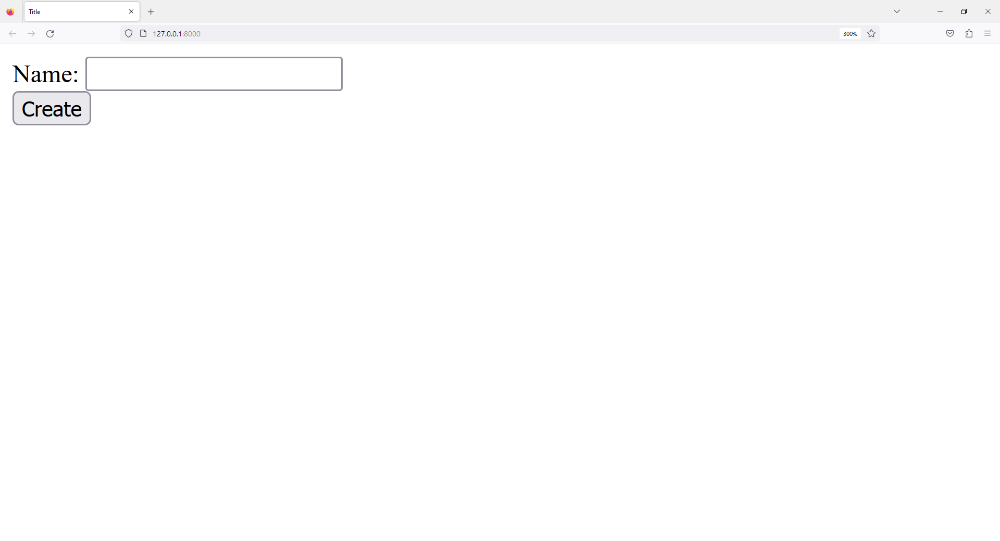
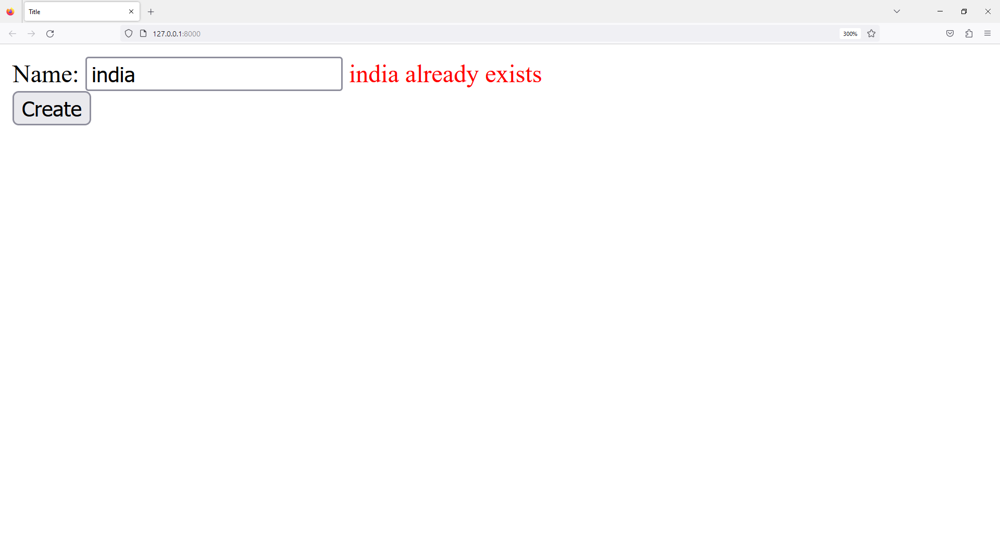
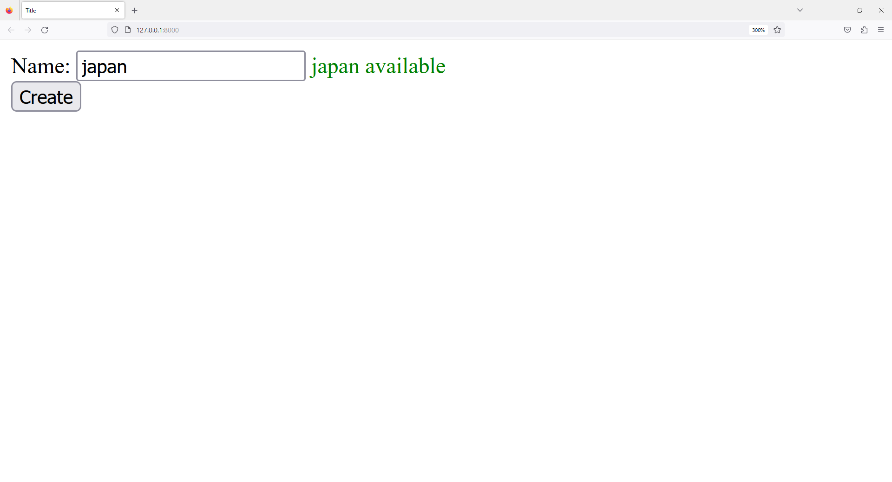

# Django-Advanced-Training
 
# 1 - models.py

```python
from django.db import models

# Create your models here.
class Country(models.Model):

    id = models.BigAutoField(primary_key=True)

    name = models.CharField(max_length=255)

    def save(self, *args, **kwargs):
        self.name = self.name.upper()
        return super(Country,self).save(*args, **kwargs)

    def __str__(self):
        return self.name

    class Meta:
        db_table = "country"
```

# 2 - views.py

```python
from django.http import HttpResponse
from django.shortcuts import render
from django.views.generic import CreateView

from backend.models import Country

class Index(CreateView):
    model = Country

    fields = '__all__'

    template_name = "backend/index.html"

def country_check(request):

    if request.method == 'POST' and request.POST.get('search_country') != '':
        country_response = Country.objects.filter(name__icontains=request.POST.get('search_country'))
        if country_response:
            errno_template = "<span style='color: red;'>{} already exists</span>".format(request.POST.get('search_country'))

            return HttpResponse(errno_template)

        else:
            success_template = "<span style='color: green;'>{} available</span>".format(request.POST.get('search_country'))
            return HttpResponse(success_template)
```

# 3 - backend - urls.py

```python
from django.urls import path
from backend.views import Index, country_check

urlpatterns = [

    path('', Index.as_view()),

    path('ajax/country_check', country_check, name='country_check')

]
```

# 4 - config - urls.py

```python
from django.contrib import admin
from django.urls import path, include

urlpatterns = [
    path('admin/', admin.site.urls),
    path('', include('backend.urls')),
]
```

# 5 - base.html

```html
<!DOCTYPE html>
<html lang="en">
<head>
    <meta charset="UTF-8">
    <title>Title</title>

    <!-- JQUERY   -->
    <script src="https://code.jquery.com/jquery-3.7.1.js" integrity="sha256-eKhayi8LEQwp4NKxN+CfCh+3qOVUtJn3QNZ0TciWLP4=" crossorigin="anonymous"></script>
    
</head>
<body>




</body>
</html>



```

# 6 - index.html

```html




<script>
    $(document).ready(function(){

        console.log("document loaded");

        $('#id_name').blur(function(){

            var search_country = $(this).val();

                $.ajax({
                    url: "ajax/country_check",
                    method: "POST",
                    headers: { 'X-CSRFtoken': '{{ csrf_token }}' },
                    data: { search_country: search_country},
                    dataType: "text",
                    success: function(data) {
                        $('#availability').html(data);
                    }
                });
        });
    });
</script>







<form method="post">
    

    
    <div class="fieldWrapper">
        {{ field.errors }}
        {{ field.label_tag }} {{ field }}
        <span id="availability"></span>
        
        <p class="help">{{ field.help_text|safe }}</p>
        
    </div>
    
    <input type="submit" value="Create">
</form>



<p>{{ element.name }}</p>




```





