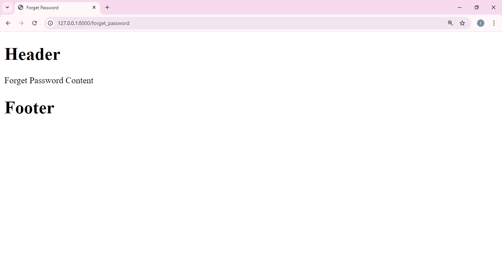

# Django-Partial-Setup
 
## Setup Instructions

### Prerequisites
Ensure you have Python installed. You can download it from [python.org](https://www.python.org/).

### Install Dependencies
 
### Go to Terminal 

1. **Create a Virtual Environment** (recommended):

   ```
    python -m venv venv
    ```

2. **Activate the Virtual Environment**:

    - On Windows:
      ```
      venv\Scripts\activate
      ```

    - On macOS and Linux:
      ```
      source venv/bin/activate
      ```
      
3. **Install Django Framework**

   ```
   pip install django
   ``` 

7. **Project Setup**
    ```
    django-admin startproject config .
    ```

8. **Create Frontend App**
    ```
    python manage.py startapp frontend
    ```

