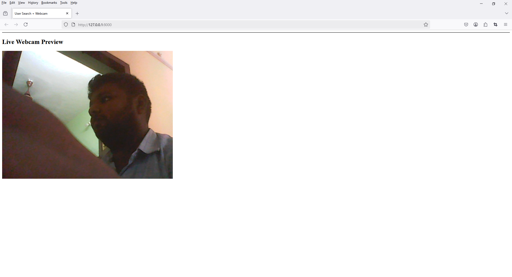

To integrate a webcam preview using OpenCV and embed it into your Django `home.html` page, you'll need a combination of:

1. OpenCV in a backend streaming view.
2. A dedicated URL for the video feed.
3. An `` tag in your template that dynamically loads frames from that view.

---

```bash
pip install django
```

```bash
django-admin startproject config .
```

```bash
python manage.py startapp frontend
```

### ✅ Step 1: Create a Video Stream View using OpenCV

#### Install OpenCV if not already:
```bash
pip install opencv-python
```

#### Add this in `views.py`:

```python
import cv2
from django.http import StreamingHttpResponse
from django.shortcuts import render


def gen_frames():
    cap = cv2.VideoCapture(0)  # 0 = default webcam

    while True:
        success, frame = cap.read()
        if not success:
            break
        else:

            # flip camera
            frame = cv2.flip(frame, 1)

            # Convert frame to JPEG
            ret, buffer = cv2.imencode('.jpg', frame)
            frame = buffer.tobytes()

            yield (b'--frame\r\n'
                   b'Content-Type: image/jpeg\r\n\r\n' + frame + b'\r\n')


def webcam_feed(request):
    return StreamingHttpResponse(gen_frames(), content_type='multipart/x-mixed-replace; boundary=frame')

def home(request):
    return render(request, "frontend/home.html")
```

---

### ✅ Step 2: Add URL for the Webcam Feed

#### `frontend/urls.py`
```python
from django.urls import path
from . import views

urlpatterns = [
    path('', views.home, name='home'),
    path('webcam/', views.webcam_feed, name='webcam-feed'),
]
```

---

### ✅ Step 3: Embed Webcam in `home.html`

#### `templates/frontend/home.html`

```html
<!DOCTYPE html>
<html lang="en">
<head>
    <meta charset="UTF-8">
    <title>User Search + Webcam</title>
</head>
<body>
    <hr>
    <h2>Live Webcam Preview</h2>
    

</body>
</html>
```

#### `config/urls.py`
```python
from django.contrib import admin
from django.urls import path, include

urlpatterns = [
    path('admin/', admin.site.urls),
    path('', include('frontend.urls'))
]
```
---

### ⚠️ Notes:
- This uses OpenCV on the server side, so it will stream **from the server's webcam**, not the client’s.
- If you want to access the **client's webcam**, you should use **JavaScript with `getUserMedia()`**, not OpenCV. Let me know if you want that instead.

---



Would you prefer **client-side webcam preview using JavaScript** instead of server-side with OpenCV?