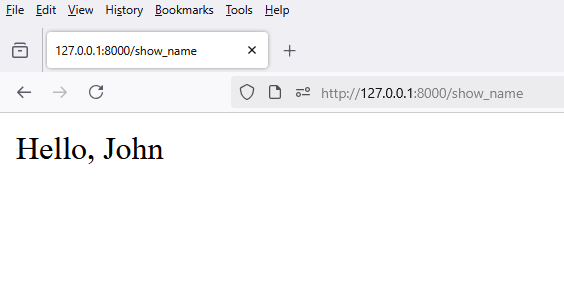

# 1 - `views.py`

```python
from django.shortcuts import render

def show_name(request):
    return render(request, 'frontend/show_name.html', {'name': 'John'})
```


# 2 - `urls.py`

```python
from django.urls import path

from frontend.views import show_name

urlpatterns = [
    path('show_name', show_name, name='show_name')
]
```

# 3 - `show_name.html`

```html
<p>Hello, {{ name }}</p>
```

