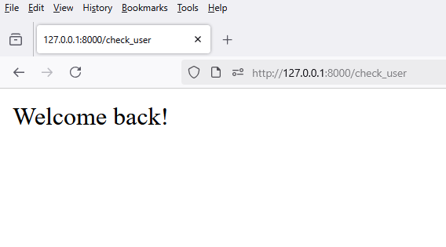
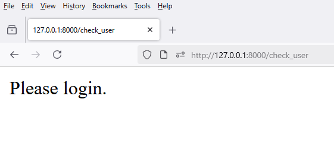

# 1 - `views.py`

```python
from django.shortcuts import render

def check_user(request):
    return render(request, 'frontend/check_user.html', {'is_logged_in': True})
```


# 2 - `urls.py`

```python
from django.urls import path

from frontend.views import check_user

urlpatterns = [
    path('check_user', check_user, name='check_user')
]
```

# 3 - `check_user.html`

```html

    <p>Welcome back!</p>

    <p>Please login.</p>

```


