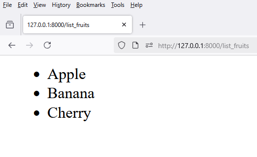

# 1 - `views.py`

```python
from django.shortcuts import render

def list_fruits(request):
    fruits = ['Apple', 'Banana', 'Cherry']
    return render(request, 'frontend/list_fruits.html', {'fruits': fruits})
```


# 2 - `urls.py`

```python
from django.urls import path

from frontend.views import list_fruits

urlpatterns = [
    path('list_fruits', list_fruits, name='list_fruits')
]
```

# 3 - `list_fruits.html`

```html
<ul>
    
      <li>{{ row }}</li>
    
</ul>
```

