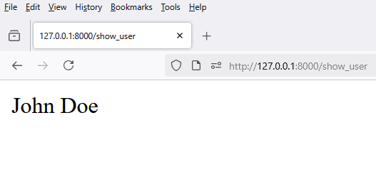

# 1 - `views.py`

```python
from django.shortcuts import render

def show_user(request):
    return render(request, 'frontend/show_user.html', {'username': 'john doe'})
```


# 2 - `urls.py`

```python
from django.urls import path

from frontend.views import show_user

urlpatterns = [
    path('show_user', show_user, name='show_user')
]
```

# 3 - `show_user.html`

```html
<p>{{ username|title }}</p>  <!-- Output: John Doe -->
```

