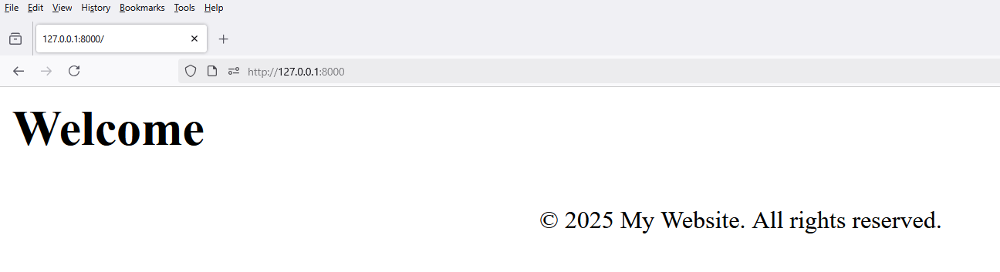

### 5. **Includes**

# 1 - `views.py`

```python
from django.shortcuts import render

def home(request):
    return render(request, 'frontend/home.html')
```

# 2 - `urls.py`

```python
from django.urls import path

from frontend.views import home

urlpatterns = [
    path('', home, name='home')
]
```

# 3 - `home.html`

```html
<h1>Welcome</h1>

<!--Footer Partial-->

```

# 4 - `footer.html`

```html
<!-- Footer -->
<footer style="text-align: center; padding: 10px;">
    &copy;  My Website. All rights reserved.
</footer>
```

