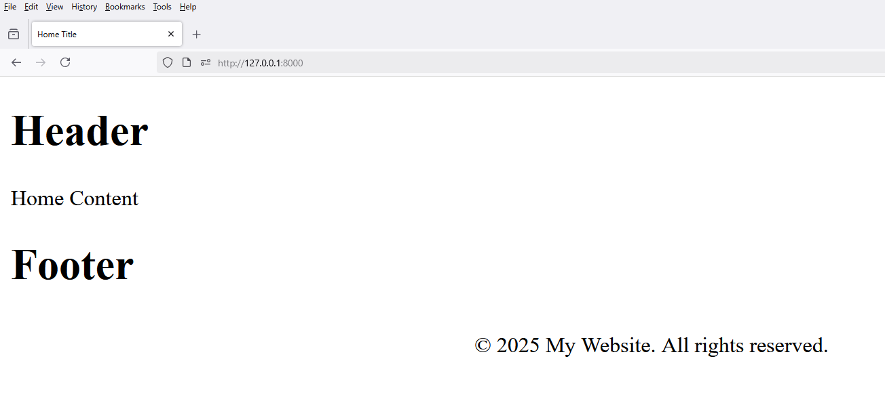

### 6. **Template Inheritance**

# 1 - Folder Setup

```
Folder Setup

project_folder - frontend -> templates

project_folder - frontend -> templates -> frontend

project_folder - frontend -> templates -> frontend -> layout

File Setup

project_folder - frontend -> templates -> frontend -> layout

app.html
topbar.html
header.html
footer.html

project_folder - frontend -> templates -> frontend

home.html
```

# 2 - `header.html`

```html
<h1>Header</h1>
```

# 4 - `footer.html`

```html
<h1>Footer</h1>

<!-- Footer -->
<footer style="text-align: center; padding: 10px;">
    &copy;  My Website. All rights reserved.
</footer>
```

# 5 - `app.html`

```html
<!DOCTYPE html>
<html lang="en">
<head>
    <meta charset="UTF-8">
    <title>
        
        
    </title>
</head>
<body>

    <!--Header Partial-->
    

    
    

    <!--Footer Partial-->
    
</body>
</html>
```

# 6 - `home.html`

```html




Home Title






Home Content


```

# 7 - frontend- views.py

```python
from django.shortcuts import render

# Create your views here.
def home(request):
    return render(request, 'frontend/home.html')
```

# 8 - frontend - urls.py

```python
from django.urls import path

from frontend.views import home

urlpatterns = [
    path('', home, name="home"),
]
```

# 9 - config - urls.py

```python
from django.contrib import admin
from django.urls import path, include

urlpatterns = [
    path('admin/', admin.site.urls),
    path('', include('frontend.urls'))
]
```

