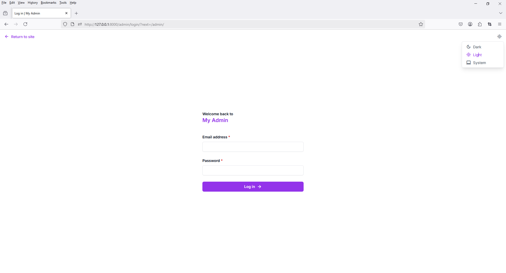
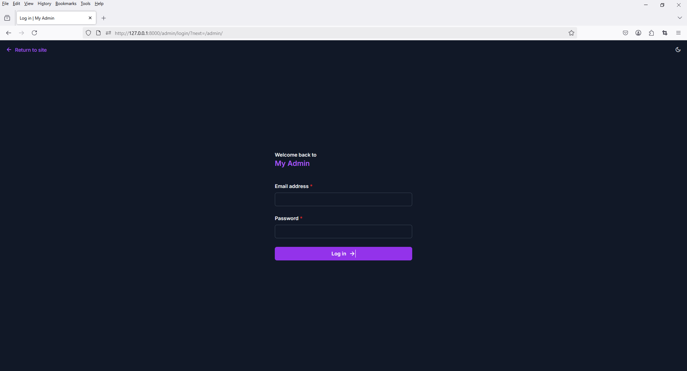

To modernize your Django admin UI using **[django-unfold](https://github.com/unfoldadmin/unfold)**, here’s how you can do it step-by-step:

---

### ✅ Step 1: Install `django-unfold`

```bash
pip install django-unfold
```

---

### ✅ Step 2: Add to `INSTALLED_APPS`

In your `settings.py`:

```python
INSTALLED_APPS = [
    'unfold',
    'django.contrib.admin',
    ...
]
```

Replace `'django.contrib.admin'` **after** `'unfold'` so Unfold can override the admin templates.

---

### ✅ Step 3: Add Unfold settings (optional but useful)

```python
UNFOLD = {
    "SITE_TITLE": "My Admin",
    "SITE_HEADER": "Dashboard",
    "SHOW_COUNTS": True,
}
```


